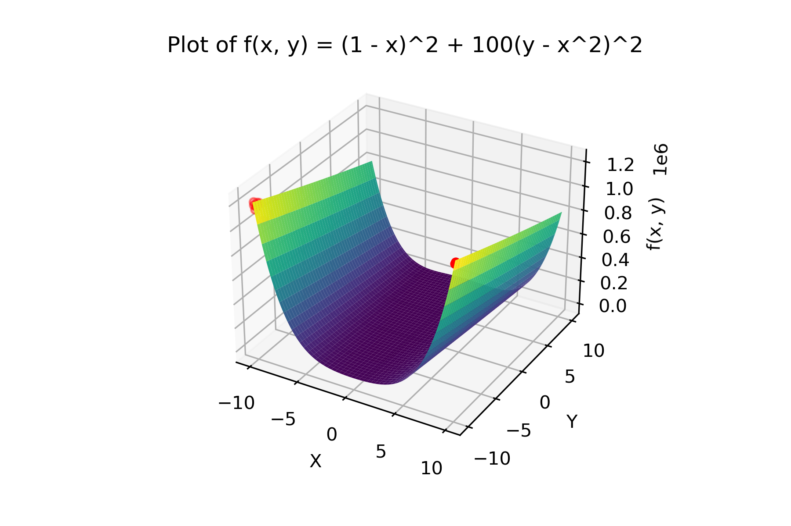
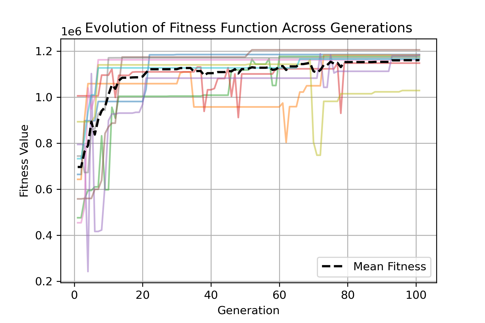

# unesp-cipn-algortimos

Study codes written during my masters degree course of natural computing:

1. Notebook named `otimizacao.py` is a iterative approach of two AI algorithms for optimization and search: Hill Climbing and Simulated Annealing. It shows the algorithm step by step using matplotlib.

2. File `choromosome.py` is an abstract class used for implementation of `chromosome_bitstring.py`, `chromosome_bitstring_max_function.py` and `chromosome_simple_equation.py`.

3. File `genetic_algorithm.py` is a general class to run the genetic algorithm for any kind of chromosome, in this work I changed many times the return of the run() method in order to get the generation age, fitness value or the instance of best chromossome,the which is the default, based on David Kopec approach in the book Classic Computer Science Problems in Python, which is where I found the code structure.

4. File `main.py` is the entry point of the code.

5. Notebooks `dispersao.ipynb` and `3d_and_series.ipynb` were used for ploting adhoc graphs only and does not sum much value here but I wanted to keep for future reuse. Take a look in some cool plot of the the results of my genetic algorithm trying optmize the function f(x, y) = (1 − x)² + 100(y − x²)²:

   

And this one is the evolution of the function result at each generation of the population initialized.

   